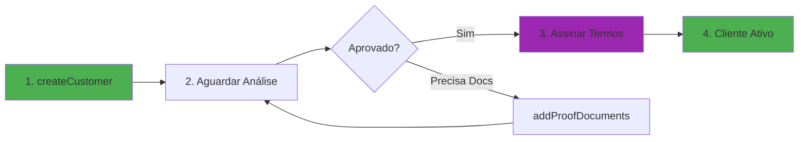
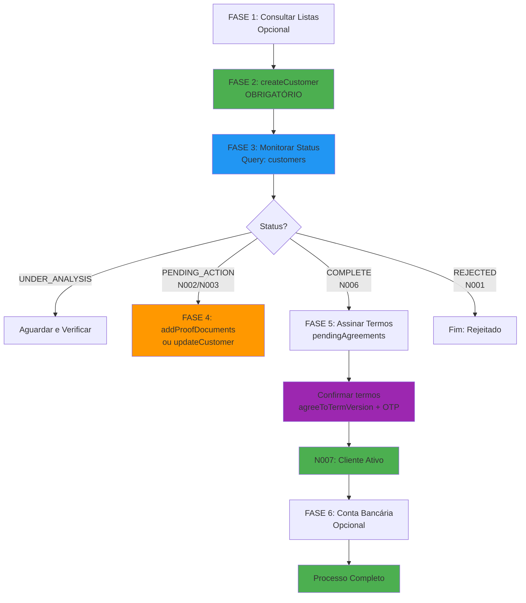
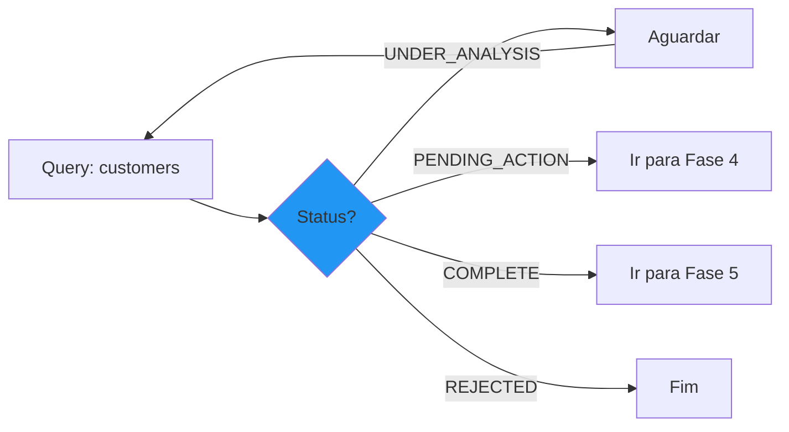
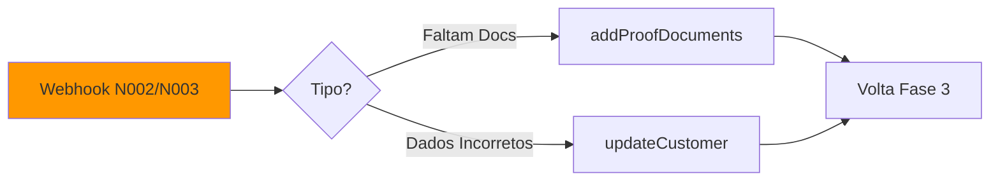
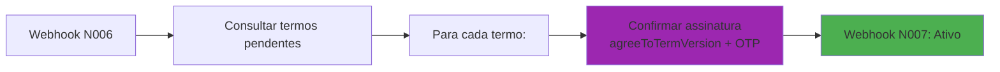

# Guia de Integração - Onboarding Ideal 

## Visão Geral

Este documento mapeia **todos os passos necessários** para realizar o onboarding de clientes na Ideal

### Fluxo Principal do Onboarding



---

## Fluxo Completo do Onboarding

### Visão Completa: Todas as Fases



---

### **FASE 1: PREPARAÇÃO (Opcional)**

Antes de criar o cliente, você pode consultar as listas de dados básicos para preencher corretamente os campos obrigatórios.

#### 1.1. Consultar Tipos de Documentos
```graphql
query IdDocumentTypes($input: GetIdDocumentTypesInput!) {
  idDocumentTypes(input: $input) {
    code
    name
    language
  }
}
```
**Variáveis:**
```json
{
  "input": {
    "language": "pt-BR"
  }
}
```
**Retorna:** `RG`, `CH` (CNH), `RN` (RNE)

---

#### 1.2. Consultar Órgãos Emissores
```graphql
query DocumentIssuingBodies($language: String!) {
  documentIssuingBodies(language: $language) {
    nodes {
      code
      name
      language
    }
  }
}
```
**Variáveis:**
```json
{
  "language": "pt-BR"
}
```
**Retorna:** `SSP`, `DPF`, etc.

---

#### 1.3. Consultar Ocupações Profissionais
```graphql
query CustomerOccupations($input: GetCustomerOccupationsInput!) {
  customerOccupations(input: $input) {
    code
    name
    language
  }
}
```
**Variáveis:**
```json
{
  "input": {
    "language": "pt-BR"
  }
}
```

---

## FASE 2: CRIAÇÃO DO CLIENTE (OBRIGATÓRIO)

### 2.1. Criar Cliente - `createCustomer`

**Este é o passo principal e OBRIGATÓRIO para iniciar o onboarding.**

```graphql
mutation CreateCustomer($input: CreateCustomerInput!) {
  createCustomer(input: $input) {
    customer {
      id
      createdAt
      individualTaxpayerRegistry
      transactionId
      customerStatus
      onboardingStatus
      etag
    }
  }
}
```

### Campos Obrigatórios do `CreateCustomerInput`

| Campo | Tipo | Descrição | Validação |
|-------|------|-----------|-----------|
| **fullName** | String | Nome completo | Máx. 60 caracteres |
| **individualTaxpayerRegistry** | String | CPF (único) | Apenas números, CPF válido |
| **dateOfBirth** | Date | Data de nascimento | YYYY-MM-DD, 18+ anos |
| **nationality** | String | Nacionalidade | ISO 3166 Alpha-3 (ex: BRA) |
| **cityOfBirth** | String | Cidade de nascimento | Máx. 100 caracteres |
| **motherFullName** | String | Nome da mãe | Máx. 60 caracteres |
| **email** | String | E-mail (único) | Formato válido |
| **maritalStatus** | Enum | Estado civil | SINGLE, MARRIED, DIVORCED, etc. |
| **isPep** | Boolean | É PEP? | true/false |
| **isUsPerson** | Boolean | É US Person? | true/false |
| **occupationCode** | String | Código da ocupação | Da lista de ocupações |
| **hasEmployer** | Boolean | Tem vínculo empregatício? | true/false |
| **annualIncomeCurrency** | String | Moeda da renda | Sempre "BRL" |
| **annualIncome** | Number | Renda anual | Entre 1.000 e 200.000.000 |
| **netWorthCurrency** | String | Moeda do patrimônio | Sempre "BRL" |
| **netWorth** | Number | Patrimônio | Entre 0 e 1.000.000.000 |

### Endereços (obrigatórios no array `addresses`)

**Requisito:** Pelo menos 1 endereço residencial (HOME) + 1 de correspondência (isMailingAddress: true)

| Campo | Tipo | Obrigatório | Descrição |
|-------|------|-------------|-----------|
| **type** | Enum | Sim | HOME, BUSINESS, OTHER |
| **street** | String | Sim | Logradouro (máx. 30 chars) |
| **number** | String | Sim | Número (máx. 5 chars) |
| **complement** | String | Não | Complemento (máx. 30 chars) |
| **district** | String | Sim | Bairro (máx. 18 chars) |
| **city** | String | Sim | Cidade (máx. 100 chars) |
| **state** | String | Sim | ISO 3166 Subdivision (ex: BR-SP) |
| **country** | String | Sim | ISO 3166 Alpha-3 (ex: BRA) |
| **zipCode** | String | Sim | CEP (apenas números) |
| **isMailingAddress** | Boolean | Sim | true para endereço de correspondência |

### Telefones (obrigatório no array `phones`)

**Requisito:** Pelo menos 1 celular (MOBILE)

| Campo | Tipo | Obrigatório | Descrição |
|-------|------|-------------|-----------|
| **type** | Enum | Sim | HOME, BUSINESS, MOBILE |
| **countryCode** | String | Sim | DDI (ex: "55") |
| **dialingCode** | String | Sim | DDD (ex: "11") |
| **number** | String | Sim | Número do telefone |
| **extensionNumber** | String | Não | Ramal |

### Documento de Identificação (objeto `identificationDocument`)

| Campo | Tipo | Obrigatório | Descrição |
|-------|------|-------------|-----------|
| **documentTypeCode** | String | Sim | RG, CH, RN |
| **number** | String | Sim | Número do documento |
| **digit** | String | Para RG | Dígito verificador |
| **dateOfIssue** | Date | Para RG | YYYY-MM-DD, < 20 anos |
| **issuingBodyCode** | String | Sim | SSP, DPF, etc. |
| **issuingState** | String | Para RG | ISO 3166 (ex: BR-PE) |
| **expirationDate** | Date | CNH/RNE | Data de validade |
| **securityCode** | String | Para CNH | Número de segurança |

### Cônjuge (objeto `spouse`)

**Obrigatório se:** `maritalStatus = MARRIED` ou `COMMON_LAW_MARRIED`

| Campo | Tipo | Obrigatório | Descrição |
|-------|------|-------------|-----------|
| **spouseName** | String | Sim | Nome completo (máx. 60 chars) |
| **spouseIndividualTaxpayerRegistry** | String | Sim | CPF válido |
| **spouseDateOfBirth** | Date | Não | YYYY-MM-DD |

### Residência Fiscal (array `taxResidenceCountries`)

**Obrigatório se:** `isUsPerson = true` (deve incluir USA)

| Campo | Tipo | Obrigatório | Descrição |
|-------|------|-------------|-----------|
| **country** | String | Sim | ISO 3166 Alpha-3 |
| **taxIdentificationNumber** | String | Para USA | TIN/SSN |

### Campos Condicionais Importantes

| Condição | Campo Obrigatório |
|----------|-------------------|
| `nationality = BRA` | `stateOfBirth` (ISO 3166 Subdivision) |
| `hasEmployer = true` | `employerTaxpayerRegistry` (CNPJ), `employerName` |
| `occupationCode = "109"` (Outros) | `occupationDescription` (máx. 40 chars) |

### Resposta Esperada

```json
{
  "data": {
    "createCustomer": {
      "customer": {
        "id": "MTMKNzc2YjE4MTQtNzQxYi00ZjdhLWIxMTItNDdiYjI1ODdlZGM4",
        "customerStatus": "INACTIVE",
        "onboardingStatus": "CREATED",
        "etag": "622c47f37671685f3ede11ceaea95f868f4818e1"
      }
    }
  }
}
```

**Status inicial:** `onboardingStatus = CREATED` → API move para `UNDER_ANALYSIS`

---

## FASE 3: MONITORAMENTO DO STATUS (OBRIGATÓRIO)

**Existem duas formas de acompanhar o status:** Query (consulta ativa) ou Webhooks (notificações automáticas).



### 3.1. Verificar Status do Onboarding (Query)

```graphql
query Customers($filter: CustomerFilterInput) {
  customers(filter: $filter) {
    nodes {
      id
      etag
      individualTaxpayerRegistry
      customerStatus
      onboardingStatus
      requiredActions
      pendingCustomerActions {
        pendingCustomerAction
        reason
      }
    }
  }
}
```

**Variáveis:**
```json
{
  "filter": {
    "individualTaxpayerRegistry": "01234567890"
  }
}
```

### Webhooks e Notificações

| Notificação | Webhook | Significado | Ação Necessária |
|-------------|---------|-------------|-----------------|
| **N001** | `ONBOARDING_REJECTED` | Cadastro rejeitado | Verificar razão e corrigir |
| **N002** | `PENDING_CUSTOMER_ACTION` | Ação necessária do cliente | Ver `pendingCustomerActions` |
| **N003** | `PENDING_CUSTOMER_REQUIRED_ACTION` | Ação obrigatória | Cliente deve agir |
| **N006** | `ONBOARDING_COMPLETED` | Onboarding aprovado | Prosseguir para assinatura |
| **N007** | `CUSTOMER_PARTNER_ONBOARDING_STATUS` | Status = COMPLETE | Cadastro finalizado |

### Possíveis Status do Onboarding

1. **CREATED** → Cliente criado, aguardando análise
2. **UNDER_ANALYSIS** → Em análise pela Ideal
3. **PENDING_CUSTOMER_ACTION** → Aguardando ação do cliente (adicionar documentos, etc.)
4. **COMPLETE** → Aprovado, aguardando assinatura de termos
5. **PENDING_ACTIVATION** → Aguardando ativação final
6. **REJECTED** → Rejeitado

---

## FASE 4: FLUXOS ALTERNATIVOS



### 4.1. Se Status = `PENDING_CUSTOMER_ACTION`

**Webhook:** N002 com campo `pendingCustomerActions`

#### Possíveis Ações Requeridas:

##### A) Adicionar Documentos de Comprovação

```graphql
mutation AddProofDocuments($input: AddProofDocumentsInput!) {
  addProofDocuments(input: $input) {
    proofDocuments {
      createdAt
      description
      name
      expiringURL {
        url
      }
    }
  }
}
```

**Input:**
- `customerId`: ID do cliente
- `file`: Arquivo (upload)
- `description`: Descrição do documento
- `etag`: ETag do cliente

##### B) Atualizar Dados do Cliente

```graphql
mutation UpdateCustomer($input: UpdateCustomerInput!) {
  updateCustomer(input: $input) {
    customer {
      id
      etag
      onboardingStatus
    }
  }
}
```

**Campos atualizáveis:** Mesmos campos do `createCustomer` + `etag` obrigatório

---

### 4.2. Se Status = `PENDING_RENEW_REGISTRATION`

**Renovação cadastral necessária (válido por 2 anos)**

```graphql
mutation RenewCustomer($input: RenewCustomerInput!) {
  renewCustomer(input: $input) {
    customer {
      id
      onboardingStatus
      etag
    }
  }
}
```

---

## FASE 5: ASSINATURA DE TERMOS (OBRIGATÓRIO)



### 5.1. Consultar Termos Pendentes

**Quando:** Após receber webhook N006 (`ONBOARDING_COMPLETED`)

```graphql
query Customers($filter: CustomerFilterInput) {
  customers(filter: $filter) {
    nodes {
      id
      pendingAgreements {
        totalCount
        nodes {
          id
          title
          description
          version
          documentBody
          documentAttachment {
            url
            size
            mimeType
          }
        }
      }
    }
  }
}
```

### 5.2. Assinar Termos

**OBRIGATÓRIO:** Assinar todos os termos pendentes para ativar a conta

```graphql
mutation AgreeToTermVersion(
  $termVersionId: ID!
  $otp: String!
) {
  agreeToTermVersion(input: {
    termVersionId: $termVersionId
    otp: $otp
  }) {
    agreedTerm {
      id
      agreed
      at
    }
  }
}
```

**Parâmetros:**
- `termVersionId`: ID do termo (da consulta anterior)
- `otp`: Código 2FA (enviado por e-mail/SMS)

**Repetir para cada termo pendente.**

---

## FASE 6: ADICIONAR CONTA BANCÁRIA (Opcional)


```graphql
mutation AddCustomerBankAccount($input: AddCustomerBankAccountInput!) {
  addCustomerBankAccount(input: $input) {
    bankAccount {
      createdAt
      bankCode
      branchCode
      accountType
      accountNumber
      accountDigit
    }
  }
}
```

### Campos Obrigatórios:

| Campo | Tipo | Descrição | Validação |
|-------|------|-----------|-----------|
| **customerId** | ID | ID do cliente | - |
| **bankCode** | String | Código do banco | 3 dígitos |
| **branchCode** | String | Código da agência | - |
| **branchDigit** | String | Dígito da agência | Opcional |
| **accountType** | Enum | Tipo de conta | CC, CP, CI |
| **accountNumber** | String | Número da conta | - |
| **accountDigit** | String | Dígito da conta | - |
| **isJointAccount** | Boolean | Conta conjunta? | Sempre false |

**Chave única:** `(bankCode, branchCode, accountNumber, accountDigit)`

---

## RESUMO: PASSOS OBRIGATÓRIOS MÍNIMOS

### Para Onboarding Bem-Sucedido:

1. **[OBRIGATÓRIO]** `createCustomer` → Criar cliente com todos os campos obrigatórios
2. **[OBRIGATÓRIO]** Monitorar `onboardingStatus` via query ou webhooks
3. **[SE NECESSÁRIO]** `addProofDocuments` → Se receber N002/N003
4. **[SE NECESSÁRIO]** `updateCustomer` → Corrigir dados se solicitado
5. **[OBRIGATÓRIO]** Aguardar `ONBOARDING_COMPLETED` (N006)
6. **[OBRIGATÓRIO]** Consultar `pendingAgreements`
7. **[OBRIGATÓRIO]** `agreeToTermVersion` → Assinar TODOS os termos
8. **[RECOMENDADO]** `addCustomerBankAccount` → Adicionar conta bancária
9. **[FINAL]** Aguardar `onboardingStatus = COMPLETE` (N007)

---

## Validações Críticas

### Campos que NÃO podem se repetir:
- `individualTaxpayerRegistry` (CPF)
- `email`

### Validações de Data:
- `dateOfBirth`: Cliente deve ter 18+ anos
- `identificationDocument.dateOfIssue`: Máximo 20 anos atrás
- `identificationDocument.expirationDate`: Não pode estar vencido

### Validações de US Person:
- Se `isUsPerson = false`: Cliente NÃO pode ter:
  - Nacionalidade USA
  - Endereço nos USA
  - Telefone com código USA
  - Residência fiscal USA

- Se `isUsPerson = true`: OBRIGATÓRIO incluir USA em `taxResidenceCountries` com TIN/SSN

### Validações de Emprego:
- Se `hasEmployer = true`: OBRIGATÓRIO preencher:
  - `employerTaxpayerRegistry` (CNPJ válido)
  - `employerName`

---


## Fluxograma Visual (Baseado na Imagem)

```
[Cliente] → Inicia cadastro
     ↓
[Parceiro] → Autentica credenciais (client_id, client_secret)
     ↓
[Ideal] → Valida credenciais + Envia token
     ↓
[Parceiro] → Envia ficha cadastral (createCustomer)
     ↓
[Ideal] → Valida dados do cliente
     ↓
┌────────────────────────────────────┐
│ ✅ Aprovado (N003)                 │
│    → ONBOARDING_COMPLETED          │
│    → Assina termos                 │
│    → Ativa conta (N006)            │
│    → N007: COMPLETE                │
└────────────────────────────────────┘
     OU
┌────────────────────────────────────┐
│ ⚠️ Ação Necessária (N001/N002)    │
│    → Solicita docs adicionais      │
│    → Cliente envia docs            │
│    → Valida novamente              │
│    → Aprovado (N003)               │
│    → Assina termos                 │
│    → Ativa conta (N006)            │
└────────────────────────────────────┘
```

---
